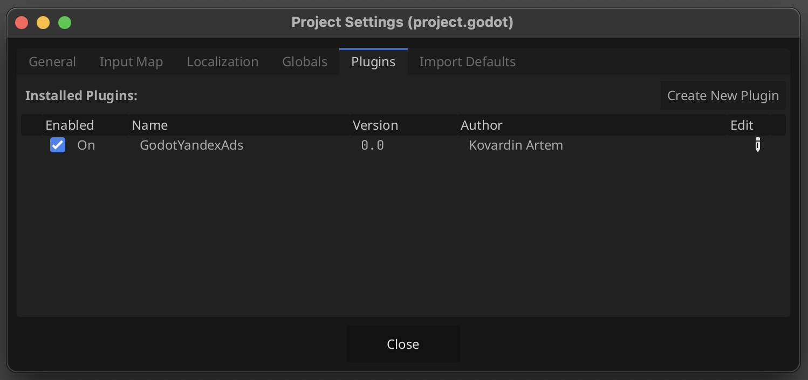

# Godot Yandex Ads

Плагин под Godot 4.2+ для интеграции Яндекс рекламы с медиацией

Подробности про использование Yandex Ads SDK в андроид [описаны в документации](https://ads.yandex.com/helpcenter/en/dev/android/quick-start)

## Настройка рекламы

Реклама настраивается в партнерском кабинете яндекса

## Интеграция

Для интеграции нужно скопировать плагин в addons/GodotYandexAds

Необходимо включить плагин через меню _Project > Project Settings_, выбрать вкладку _Plugins_ и отметить как **Enable** плагин с названием "GodotYandexAds"




## Использование

Плагин позволяет интегрировать разные форматы рекламы в приложение:

- banner
- interstitial
- rewarded
- appopen

Пример как в коде использовать плагин:

```gdscript
extends Node2D

var _plugin_name = "GodotYandexAds"

@onready var interstitial_button = $CanvasLayer/VBoxContainer/Interstitial
@onready var rewared_button = $CanvasLayer/VBoxContainer/Rewarded
@onready var banner_button = $CanvasLayer/VBoxContainer/Banner


func _ready():
	rewared_button.pressed.connect(_on_rewarded_button_pressed)
	interstitial_button.pressed.connect(_on_interstitial_button_pressed)
	banner_button.pressed.connect(_on_banner_button_pressed)

	if Engine.has_singleton(_plugin_name):
		var ads = Engine.get_singleton(_plugin_name)

		ads.banner_loaded.connect(_ad_loaded)
		ads.banner_on_impression.connect(_on_impression)

		ads.interstitial_loaded.connect(_ad_loaded)
		ads.interstitial_ad_shown.connect(_ad_shown)
		ads.interstitial_on_impression.connect(_on_impression)

		ads.rewarded_rewarded.connect(_rewarded)
		ads.rewarded_ad_shown.connect(_ad_shown)
		ads.rewarded_on_impression.connect(_on_impression)

		ads.loadBanner("demo-banner-yandex", {"size_type": "sticky", "width": 300, "position":0})
		ads.loadInterstitial("demo-interstitial-yandex")
		ads.loadRewarded("demo-rewarded-yandex")

    
func _on_banner_button_pressed():
	if Engine.has_singleton(_plugin_name):
		var ads = Engine.get_singleton(_plugin_name)
		ads.showBanner("demo-banner-yandex")


func _on_interstitial_button_pressed():
	if Engine.has_singleton(_plugin_name):
		var ads = Engine.get_singleton(_plugin_name)
		ads.showInterstitial("demo-interstitial-yandex")


func _on_rewarded_button_pressed():
	if Engine.has_singleton(_plugin_name):
		var ads = Engine.get_singleton(_plugin_name)
		ads.showRewarded("demo-rewarded-yandex")


func _rewarded(id: String, data: Dictionary):
	print("_rewarded: " + id)
	print(data)


func _ad_loaded(id: String):
	print("_ad_loaded: " + id)


func _ad_shown(id: String):
	print("_ad_shown: " + id)


func _on_impression(id: String, data: String):
	print("_on_impression: " + id)
	print(data)
```

В этом примере используются демонстрацонные идентификаторы для юнитов разных форматов: demo-banner-yandex, demo-interstitial-yandex, demo-rewarded-yandex

### Общие сишналы

- **ads_initialized** - срабатывает при инициализации плашина

### Сигналы для баннеров

- **banner_loaded** - 
- **banner_failed_to_load**
- **banner_ad_clicked**
- **banner_left_application**
- **banner_returned_to_application**
- **banner_on_impression**

### Сигналы для интерстишелов

- **interstitial_loaded** -
- **interstitial_failed_to_load**
- **interstitial_failed_to_show**
- **interstitial_ad_shown**
- **interstitial_ad_dismissed**
- **interstitial_ad_clicked**
- **interstitial_on_impression**

### Сигналы для ревордед

- **rewarded_loaded**
- **rewarded_failed_to_load**
- **rewarded_ad_shown**
- **rewarded_ad_dismissed**
- **rewarded_rewarded**
- **rewarded_ad_clicked**
- **rewarded_on_impression**